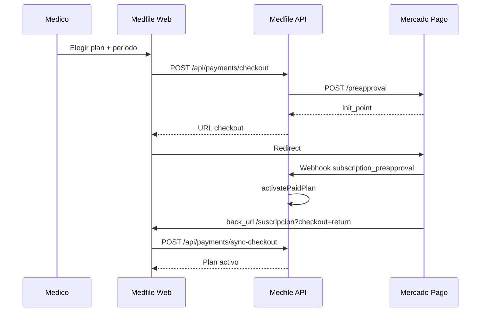

# Mercado Pago — suscripciones Medfile (Bolivia)

Integracion de cobro recurrente para planes **Basico** y **Profesional** en Bolivia (BOB). Complementa [11-suscripciones-limites.md](./11-suscripciones-limites.md) y [24-planes-medico-independiente-bolivia.md](./24-planes-medico-independiente-bolivia.md).

---

## Decision

| Aspecto | Detalle |
|---------|---------|
| **Proveedor** | Mercado Pago (primario para BO) |
| **Modelo** | Suscripcion recurrente (`preapproval` API) |
| **Moneda** | **BOB** |
| **Quien paga** | Cada medico, su tarjeta / saldo MP |
| **Fuente de verdad** | Webhook + sync al volver del checkout |

Stripe queda como alternativa futura si Medfile opera merchant fuera de Bolivia.

**Alternativa local:** pago puntual con **QR Banco Económico** — ver [30-banco-economico-qr-bolivia.md](./30-banco-economico-qr-bolivia.md). El médico elige en `/suscripcion` según toggles del panel admin ([31](./31-panel-admin-plataforma.md)).

---

## Flujo



---

## Endpoints

| Metodo | Ruta | Auth | Descripcion |
|--------|------|------|-------------|
| POST | `/api/payments/checkout` | JWT | Crea preapproval MP y devuelve `initPoint` |
| POST | `/api/payments/sync-checkout` | JWT | Consulta estado MP y activa plan al volver |
| POST | `/api/payments/confirm-mock` | JWT | Solo modo prueba sin credenciales MP |
| POST/GET | `/api/webhooks/mercadopago` | Publico | Notificaciones MP |

---

## Variables de entorno

```env
PAYMENTS_PROVIDER=mock          # mock | mercadopago
MERCADOPAGO_ACCESS_TOKEN=       # TEST-... sandbox / APP_USR-... prod
MERCADOPAGO_PUBLIC_KEY=         # opcional frontend futuro
WEB_ORIGIN=http://localhost:3100
```

- Sin `MERCADOPAGO_ACCESS_TOKEN` → **modo mock** (desarrollo).
- Con token `TEST-` → sandbox Mercado Pago.

---

## Precios cobrados (BOB)

Calculados en `packages/types/src/plans.ts` → `calculatePlanChargeBob`:

| Plan | Mensual | Trimestral (-10 %) | Anual (10 meses · 12 servicio) |
|------|---------|-------------------|--------------------------------|
| Basico | Bs 98 | Bs 264 | Bs 980 |
| Profesional | Bs 224 | Bs 605 | Bs 2240 |

`external_reference` en MP: `medfile:{tenantId}:{planCode}:{billingPeriod}`

---

## Estados de suscripcion

| Evento MP | Accion Medfile |
|-----------|----------------|
| `authorized` / `active` | `activatePaidPlan` → plan Basico/Profesional |
| `cancelled` | `downgradeToFree` → plan Gratis, datos intactos |
| `paused` / `pending` | `markCheckoutPending` / `past_due` |

Campos en `Subscription`:

- `mercadopagoPreapprovalId`
- `pendingPlanCode`
- `billingPeriod`
- `paymentProvider` (`mock` | `mercadopago`)
- `lastPaymentAt`

Idempotencia webhooks: coleccion `PaymentEvent` con `eventKey` unico.

---

## Checklist primera vez (negocio)

1. Cuenta **Mercado Pago negocio** Bolivia verificada.
2. App en [developers.mercadopago.com](https://www.mercadopago.com.bo/developers).
3. Credenciales **TEST** en `.env`.
4. Webhook publico (ngrok en local): `https://xxx.ngrok.io/api/webhooks/mercadopago`
5. Probar tarjetas de prueba MP.
6. Pasar a produccion con `APP_USR-` token.

---

## Desarrollo local (mock)

1. `PAYMENTS_PROVIDER=mock` (default sin token).
2. `/suscripcion` → **Pagar con Mercado Pago** → activa plan sin MP real.
3. `simulate-upgrade` sigue disponible para dev rapido.

---

## Archivos

| Capa | Ruta |
|------|------|
| Servicio MP | `apps/api/src/modules/payments/mercadopago.service.ts` |
| Orquestacion | `apps/api/src/modules/payments/payments.service.ts` |
| Webhook | `apps/api/src/modules/payments/mercadopago-webhook.controller.ts` |
| Checkout UI | `apps/web/pages/suscripcion/index.vue` |
| Precios | `packages/types/src/plans.ts` |

---

## Documentos relacionados

- [11-suscripciones-limites.md](./11-suscripciones-limites.md)
- [24-planes-medico-independiente-bolivia.md](./24-planes-medico-independiente-bolivia.md)
