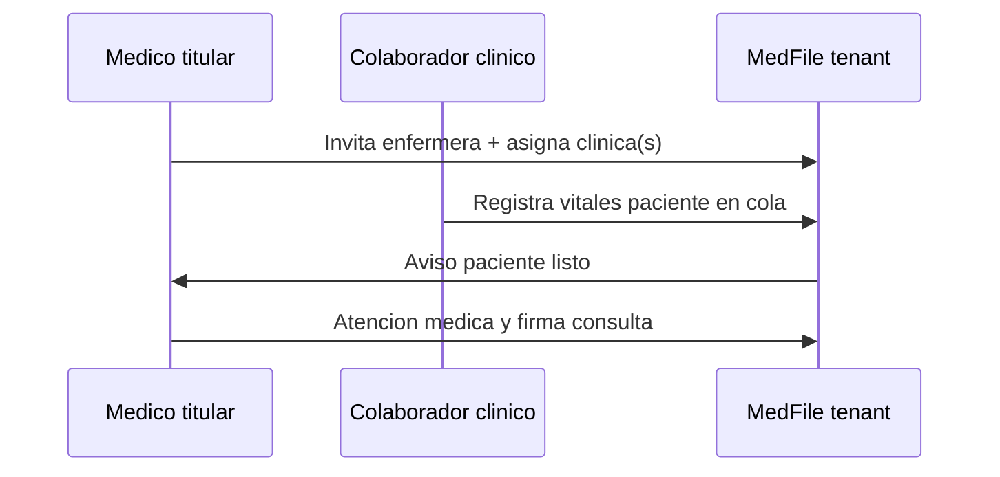

# Equipo del medico: asistente, captura clinica y relacion con compartir entre medicos

Documento de **producto, permisos, planes y arquitectura** para usuarios delegados dentro del tenant del medico titular, y como conviven con **compartir historial con otro medico Medfile** ([22-intercambio-historiales-entre-medicos.md](./22-intercambio-historiales-entre-medicos.md)).

> **Estado:** **Fases 1–5 implementadas** — `assistant`, `clinical_capture`, invitaciones, auditoría (Pro), cola del día, clínicas, `/cuenta/equipo`, `/cola-clinica`.

---

## 1. Proposito

Medfile es la app del **medico independiente** (1 tenant = 1 suscripcion). En la practica, el medico no trabaja solo:

- Tiene **asistente o secretaria** en su consultorio privado.
- Atiende en **varias clinicas** donde **enfermeria** toma signos vitales y recibe documentos antes de la consulta.

Este documento define **tres modelos de acceso distintos** que no deben mezclarse:

| Modelo | Quien | Alcance | Plan tipico |
|--------|-------|---------|-------------|
| **A. Enlace paciente** | Paciente (sin cuenta Medfile) | Subir archivos por token | Gratis+ |
| **B. Equipo delegado** | Asistente / colaborador clinico **del mismo tenant** | Tareas bajo autorizacion del titular | Basico / Profesional |
| **C. Compartir con colega** | **Otro medico** (otro tenant) | Prestamo controlado de historial | Profesional |

```text
                    ┌─────────────────────────────────────────┐
                    │     Medico titular (Tenant Dr. Rivas)    │
                    │     Pacientes, consultas, documentos     │
                    └───────────────┬─────────────────────────┘
                                    │
        ┌───────────────────────────┼───────────────────────────┐
        ▼                           ▼                           ▼
  B. EQUIPO (mismo tenant)    A. PACIENTE (token)      C. COLEGA (otro tenant)
  Asistente / Enfermera       /paciente/subir          Codigo Medfile + share
  Invitacion del titular      Sin login                Solo medico titular inicia
```

**Regla de oro:** compartir con colega **nunca** sustituye al asistente ni a la enfermera; son relaciones juridicas y tecnicas diferentes.

---

## 2. Problemas que resuelve cada rol

### 2.1 Asistente del medico

**Dolor:** el medico pierde tiempo en filiacion, enlaces de subida, seguimiento y bandeja administrativa.

**Valor:** delegar carga **no clinica** sin ceder responsabilidad medica.

**Necesidad:** **alta** — prioridad P1; ya previsto en [18-modelo-freemium-y-oferta.md](./18-modelo-freemium-y-oferta.md) y [19-servicios-adicionales-catalogo.md](./19-servicios-adicionales-catalogo.md).

### 2.2 Colaborador clinico (enfermeria en clinica)

**Dolor:** el medico rota por centros; enfermeria registra vitales en papel o WhatsApp; el medico reescribe en consulta.

**Valor:** captura **estructurada** (signos vitales, triage, adjuntos) en el tenant del medico **antes** de la atencion.

**Necesidad:** **media-alta** en segmento de alto volumen; no reemplaza el enlace de subida del paciente ni al asistente.

**No construir:** EMR de clinica, multi-medico por centro, facturacion compartida entre colegas.

### 2.3 Compartir con otro medico (ya existente)

**Dolor:** interconsulta, referencia, segunda opinion entre colegas Medfile.

**Valor:** prestamo temporal de bloques del historial con permisos y revocacion.

**Estado MVP:** implementado (solo lectura, plan Profesional). Ver [22-intercambio-historiales-entre-medicos.md](./22-intercambio-historiales-entre-medicos.md).

**Diferencia clave vs equipo:**

| | Equipo (B) | Compartir colega (C) |
|--|------------|----------------------|
| Tenant | **Mismo** que el titular | **Distinto** (receptor tiene su tenant) |
| Dueno del paciente | Titular original | Titular original (salvo transferencia futura) |
| Quien invita | Medico titular | **Solo medico** (owner/doctor), no asistente por defecto |
| Permiso tipico | Operativo / captura | Solo lectura (MVP) |
| Plan | Basico+ (asistente), Pro (captura clinica) | **Profesional** |

---

## 3. Roles de usuario (tenant interno)

Codigo existente: `TenantRole = 'owner' | 'doctor' | 'assistant'` (`packages/types/src/index.ts`). Se propone ampliar:

| Rol | Codigo propuesto | Descripcion |
|-----|------------------|-------------|
| **Propietario / medico titular** | `owner` | Quien paga, invita equipo, comparte con colegas, firma clinica |
| **Medico adicional** | `doctor` | Reservado futuro (plan Clinica); fuera de alcance actual |
| **Asistente administrativo** | `assistant` | Secretaria: filiacion, subidas, bandeja, recordatorios |
| **Colaborador clinico** | `clinical_capture` | Enfermeria delegada: vitales, nota enfermeria, adjuntos acotados |

> **Nota:** `clinical_capture` puede implementarse como sub-rol de permisos sobre `assistant` en v1; rol separado recomendado en v2 para auditoria clara.

### 3.1 Matriz de permisos — Asistente (`assistant`)

| Accion | Permitido | Notas |
|--------|:---------:|-------|
| Ver listado y buscar pacientes | ✅ | |
| Crear / editar **filiacion** (contacto, domicilio, seguro) | ✅ | Sin eliminar paciente |
| Ver resumen clinico (alergias, alertas) | ✅ | Solo lectura |
| Editar **antecedentes** completos | ❌ | Solo medico titular |
| Registrar **consulta / diagnostico** | ❌ | |
| Crear solicitud de subida + copiar enlace / wa.me | ✅ | Consume cupo del tenant |
| Ver bandeja documentos; marcar “pendiente medico” | ✅ | |
| Clasificar / aprobar documento como clinico | ❌ | |
| Enviar recordatorios email / WhatsApp automatico | ✅ | Cupo del plan del titular |
| **Compartir historial con colega** | ❌ | Solo owner/doctor |
| Ver **Compartidos** (shares enviados/recibidos) | 🟡 | Solo lectura opcional |
| Gestionar suscripcion / pagos | ❌ | |
| Invitar / revocar usuarios | ❌ | Solo owner |
| Export masivo / eliminar paciente | ❌ | |

### 3.2 Matriz de permisos — Colaborador clinico (`clinical_capture`)

| Accion | Permitido | Notas |
|--------|:---------:|-------|
| Ver pacientes en **cola autorizada** (dia / lista / check-in) | ✅ | API filtra listado y acceso individual |
| Ver **vitales de enfermería** en perfil del paciente | ✅ | Panel en `/pacientes/[id]` (plan Pro) |
| **Agregar paciente a cola** desde perfil | ✅ | Titular en plan Pro |
| Ver datos minimos (nombre, edad, alergias en alertas) | ✅ | |
| Registrar **signos vitales** | ✅ | Plantilla estructurada |
| Nota de enfermeria / triage | ✅ | No diagnostico ni plan |
| Adjuntar documentos (`source: nurse`) | ✅ | |
| Editar filiacion completa | ❌ | |
| Antecedentes, consultas firmadas, compartir colega | ❌ | |
| Acceso fuera de **contexto de clinica** asignado | ❌ | Etiqueta “Clinica X” |

**Flujo recomendado:**



Opcional fase 2: entradas de enfermeria en **borrador** hasta incorporacion en consulta del medico.

### 3.3 Matriz — Compartir con colega medico (inter-tenant)

No duplica permisos de equipo. Referencia completa: [22-intercambio-historiales-entre-medicos.md](./22-intercambio-historiales-entre-medicos.md).

| Accion | Quien inicia | Plan |
|--------|--------------|------|
| Compartir historial (MVP solo lectura) | Medico titular | Profesional |
| Aceptar share entrante | Medico receptor | Plan pago receptor (segun reglas doc 22) |
| Asistente inicia share | ❌ por defecto | Configurable futuro “solo preparar borrador” |

---

## 4. Planes comerciales recomendados

Alineado con [24-planes-medico-independiente-bolivia.md](./24-planes-medico-independiente-bolivia.md) y [11-suscripciones-limites.md](./11-suscripciones-limites.md).

### 4.1 Limites de usuarios (objetivo)

| Plan | Usuarios incluidos | Capabilities |
|------|-------------------|--------------|
| **Gratis** | 1 (medico) | Sin equipo |
| **Basico** | **2** (medico + **1 asistente**) | `assistantUsers: true` |
| **Profesional** | **3** (medico + **2 colaboradores**) | Asistente + **1 captura clinica** *o* 2 asistentes; `clinicalCaptureUsers: true`; auditoria |

**Compartir con colega:** sigue siendo **solo Profesional** (`clinicalShare: true`). No mover a Basico: es diferenciador de alto valor y costo de soporte/compliance.

### 4.2 Por que no poner enfermeria en Basico

- Mayor riesgo clinico y legal; exige **auditoria por usuario** (roadmap Profesional).
- Perfil de medico en multiples clinicas correlaciona con plan Profesional (volumen, automatizacion).
- Mantiene escalon claro Basico → Profesional.

### 4.3 Por que si poner asistente en Basico

- ROI claro en ~Bs 98/mes (“paga la secretaria en el sistema”).
- Bajo riesgo si permisos son administrativos.
- Coherente con copy ya publicado en [18-modelo-freemium-y-oferta.md](./18-modelo-freemium-y-oferta.md).

### 4.4 Add-on futuro

| Add-on | Unidad | Cliente |
|--------|--------|---------|
| Usuario extra (asistente) | /usuario/mes | Profesional con equipo grande |
| Capacitacion asistente | one-shot | Onboarding consultorio |

Ver [19-servicios-adicionales-catalogo.md](./19-servicios-adicionales-catalogo.md).

### 4.5 Matriz resumida funcionalidad × plan

| Funcionalidad | Gratis | Basico | Profesional |
|---------------|:------:|:------:|:-----------:|
| 1 medico titular | ✅ | ✅ | ✅ |
| Asistente administrativo | ❌ | ✅ **1** | ✅ **hasta 2 slots** |
| Colaborador clinico (enfermeria) | ❌ | ❌ | ✅ **1** |
| Auditoria por usuario | ❌ | 🟡 minima | ✅ |
| Compartir historial colega Medfile | ❌ | ❌ | ✅ |
| Enlace subida paciente | ✅ | ✅ | ✅ |

---

## 5. Experiencia del medico titular

### 5.1 Modulo **Equipo** (nuevo)

Ruta propuesta: `/cuenta/equipo` o `/configuracion/equipo`.

El medico puede:

1. **Invitar** por correo (rol: asistente o colaborador clinico).
2. Elegir **plantilla de permisos** (Administrativo / Captura clinica / Personalizado v2).
3. **Revocar** acceso al instante.
4. Asignar **contexto de clinica** al colaborador clinico (ej. “Centro Medico Norte”).
5. Ver **actividad reciente** (Profesional): altas, subidas, vitales, accesos.

### 5.2 Convivencia con **Compartidos**

| Pantalla | Proposito |
|----------|-----------|
| `/compartidos` | Historial prestado **entre medicos** (inter-tenant) |
| `/cuenta/equipo` | Personas **dentro de mi consultorio** (intra-tenant) |
| `/pacientes/[id]/compartir` | Iniciar share con **Codigo Medfile** de colega |

Copy orientativo en UI: *“Tu equipo trabaja en tu consultorio. Compartir con colega entrega una copia de lectura a otro medico Medfile.”*

### 5.3 Impacto en flujos existentes

| Flujo actual | Con asistente | Con captura clinica |
|--------------|---------------|---------------------|
| Alta paciente | Asistente completa filiacion | — |
| Solicitar subida | Asistente genera y envia enlace | Enfermeria adjunta en recepcion |
| Bandeja documentos | Asistente triage | Docs con `source: nurse` |
| Perfil paciente | Medico ve alertas + timeline | Medico ve vitales precargados |
| Compartir colega | Solo medico | Solo medico |

---

## 6. Modelo de datos y API (diseño)

### 6.1 Entidades propuestas

| Entidad | Campos clave |
|---------|--------------|
| `TenantMember` | `tenantId`, `userId`, `role`, `status`, `invitedBy`, `clinicContexts[]`, `permissions` |
| `TeamInvitation` | `email`, `role`, `token`, `expiresAt`, `acceptedAt` |
| `AuditLog` | `tenantId`, `userId`, `role`, `action`, `resourceType`, `resourceId`, `metadata`, `at` |

Usuario invitado: cuenta Medfile propia (email + password) **vinculada al tenant del medico**, no suscriptor separado.

### 6.2 Endpoints propuestos

| Metodo | Ruta | Rol |
|--------|------|-----|
| `GET` | `/api/team/members` | owner |
| `POST` | `/api/team/invitations` | owner |
| `DELETE` | `/api/team/members/:id` | owner |
| `PATCH` | `/api/team/members/:id` | owner (permisos / revocar) |
| `POST` | `/api/team/invitations/accept` | invitado |
| `GET` | `/api/team/audit` | owner (Profesional) |

Enforcement: `PlanLimitsService.assertCanInviteUser(tenantId)` segun `limits.users` del plan.

### 6.3 Guards

- `TenantAuthGuard` + `RolesGuard` por endpoint.
- Compartir clinico (`ClinicalSharesModule`): **solo** `owner` | `doctor`.
- Documentos creados por asistente: `source: 'assistant'` (ya en tipos).
- Documentos por enfermeria: ampliar enum a `'nurse'` o reutilizar `'assistant'` con metadata `captureRole`.

### 6.4 Cambios en `plans.ts` (futuro)

```ts
// Objetivo — no aplicado aun en codigo
limits.users: free=1, basic=2, professional=3
capabilities.assistantUsers: basic=true, professional=true
capabilities.clinicalCaptureUsers: professional=true
capabilities.auditLog: professional=true
```

---

## 7. Legal, privacidad y confianza

1. **Responsable del tratamiento:** medico titular del tenant.
2. **Consentimiento del paciente:** informar que personal autorizado accede a datos (texto en filiacion o aviso en clinica).
3. **Auditoria:** acciones clinicas de no-medico con timestamp + `userId` + rol.
4. **Revocacion:** al dejar una clinica, el medico revoca colaboradores de ese contexto.
5. **Terminos:** usuario invitado acepta acceso a datos sensibles sin ser cliente de pago.
6. **Compartir con colega:** consentimiento registrado en flujo share (ya en MVP); **independiente** del consentimiento para asistente/enfermeria.

Detalle seguridad: [12-seguridad-tenant-sesion.md](./12-seguridad-tenant-sesion.md).

---

## 8. Roadmap de implementacion

| Fase | Entregable | Plan | Dependencias |
|------|------------|------|--------------|
| **1** | Rol `assistant` + permisos admin + invitacion 1 usuario | Basico | Guards, `limits.users` |
| **2** | UI `/cuenta/equipo` + enforcement cupos | Basico | Fase 1 |
| **3** | Auditoria por usuario | Profesional | Fase 1 |
| **4** | Rol captura clinica + vitales + cola del dia | Profesional | Fase 3 |
| **5** | Contexto multi-clinica + plantillas enfermeria | Profesional | Fase 4 |

**No mezclar** con fases de compartir colega (doc 22): colaborar / transferir paciente son tracks separados.

Orden recomendado respecto a producto actual:

1. Asistente (Basico) — maximo impacto comercial.
2. Auditoria (Profesional) — prerequisito captura clinica.
3. Captura clinica (Profesional).
4. Mejoras share colega (colaborar, transferir) en paralelo segun doc 22.

---

## 9. Relacion con otros documentos

| Tema | Documento |
|------|-----------|
| Compartir entre medicos | [22-intercambio-historiales-entre-medicos.md](./22-intercambio-historiales-entre-medicos.md) |
| Codigo Medfile | [23-codigo-medfile.md](./23-codigo-medfile.md) |
| Planes y precios | [24-planes-medico-independiente-bolivia.md](./24-planes-medico-independiente-bolivia.md) |
| Matriz freemium | [18-modelo-freemium-y-oferta.md](./18-modelo-freemium-y-oferta.md) |
| Catalogo servicios | [19-servicios-adicionales-catalogo.md](./19-servicios-adicionales-catalogo.md) |
| Limites tecnicos | [11-suscripciones-limites.md](./11-suscripciones-limites.md) |
| Roles JWT | [12-seguridad-tenant-sesion.md](./12-seguridad-tenant-sesion.md) |
| Roadmap medico | [28-medico-funcionalidades-y-roadmap.md](./28-medico-funcionalidades-y-roadmap.md) |
| Enlace paciente | [09-documentos-solicitudes-subida.md](./09-documentos-solicitudes-subida.md) |

---

## 10. Decisiones cerradas (resumen)

1. **Asistente** necesario → **Plan Basico**, 1 usuario incluido.
2. **Enfermeria / captura clinica** valiosa pero acotada → **Plan Profesional**, con auditoria.
3. **Compartir con colega** permanece **inter-tenant, solo medico, Profesional** — no confundir con equipo.
4. **Gratis** sin usuarios delegados.
5. Medico titular siempre responsable; revocacion instantanea; sin EMR de clinica en este alcance.
