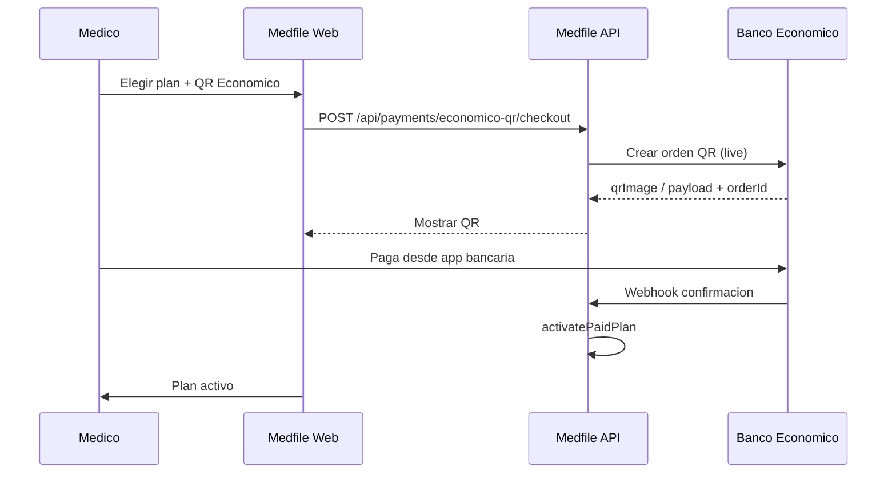

# Banco Económico — cobro con QR (Bolivia)

Integración de pago por **QR del Banco Económico** para suscripciones Medfile en **bolivianos (BOB)**. Complementa [26-mercadopago-bolivia.md](./26-mercadopago-bolivia.md) y [11-suscripciones-limites.md](./11-suscripciones-limites.md).

> **Estado:** integración **completa** con kit SiiPi/Baneco — cliente HTTP, MongoDB `QrPayment`, webhook, polling en `/suscripcion`. Modo mock sin credenciales (`PAYMENTS_PROVIDER=mock`).

---

## Decisión de producto

| Aspecto | Detalle |
|---------|---------|
| **Moneda de precios** | **BOB** (Bs) en landing y `/suscripcion` |
| **Referencia USD** | Solo nota secundaria (`ref. $14 USD`) — tipo de cambio en `PLAN_PRICE_BOB_PER_USD` |
| **Proveedores** | Mercado Pago (recurrente) **o** QR Banco Económico (pago puntual por periodo) |
| **Quién configura** | Panel **admin** Medfile (`/admin/configuracion`) + variables de entorno |
| **Quién paga** | Cada médico titular |

El médico elige en `/suscripcion`:

- **Pagar con Mercado Pago** — suscripción recurrente (existente).
- **Pagar con QR Banco Económico** — genera QR con monto en Bs según plan y periodo.

---

## Precios en BOB

Fuente: `packages/types/src/plans.ts` → `monthlyPriceBob`, `calculatePlanChargeBob()`.

| Plan | Mensual | Trimestral (−10 %) | Anual (10 meses · 12 de servicio) |
|------|---------|-------------------|-----------------------------------|
| Básico | Bs 98 | Bs 264 | **Bs 980** (≈ Bs 82/mes) |
| Profesional | Bs 224 | Bs 605 | **Bs 2 240** (≈ Bs 187/mes) |

UI web: `apps/web/utils/plan-pricing-display.ts`.

---

## Flujo QR (objetivo)



### Modo desarrollo (implementado)

Sin credenciales BE:

- QR simulado (`api.qrserver.com` con payload `MOCK-BE-QR|…`).
- `paymentProvider: mock` en suscripción pendiente.
- Activación manual vía flujo mock existente o webhook futuro.

---

## Endpoints Medfile

| Método | Ruta | Auth | Descripción |
|--------|------|------|-------------|
| GET | `/api/payments/options` | JWT médico | Proveedores habilitados + moneda BOB |
| POST | `/api/payments/checkout/qr` | JWT médico | Genera QR (`planCode`, `billingPeriod`) |
| GET | `/api/payments/checkout/:id/status` | JWT médico | Polling estado (pending/paid/expired) |
| POST | `/api/payments/checkout/:id/confirm-mock` | JWT médico | Simular pago (solo `PAYMENTS_PROVIDER=mock`) |
| POST | `/api/payments/economico-qr/checkout` | JWT médico | Alias de `checkout/qr` |
| POST | `/api/webhooks/economico` | Público | Confirmación del banco |

Mercado Pago sin cambios: [26-mercadopago-bolivia.md](./26-mercadopago-bolivia.md).

---

## Variables de entorno

```env
MEDFILE_ADMIN_EMAILS=admin@medfile.my

BANECO_USER_NAME=
BANECO_PASSWORD=
BANECO_AES_KEY=
BANECO_ACCOUNT_CREDIT=
BANECO_BASE_URL=https://apimktdesa.baneco.com.bo/ApiGateway
BANECO_BRANCH_CODE=

PAYMENTS_PROVIDER=mock
```

**Secrets:** nunca en MongoDB; solo en Railway / `.env.local`.

---

## Configuración en panel admin

Ruta: `/admin/configuracion` (requiere email en `MEDFILE_ADMIN_EMAILS`).

| Campo | Descripción |
|-------|-------------|
| `defaultProvider` | mock · mercadopago · economico_qr |
| `mercadopagoEnabled` | Mostrar botón MP |
| `economicoQrEnabled` | Mostrar botón QR |
| `economicoMerchantLabel` | Texto en instrucciones |
| `economicoInstructions` | Copy para el médico |

Persistencia: colección `PlatformSettings` (`scope: global`).

---

## Kit SiiPi (origen)

Cliente portado desde `apps/api/src/modules/payments/` (kit `medfile-kit`). Guía local: `LEEME.md` en esa carpeta.

Persistencia Medfile: colección MongoDB **`QrPayment`** (no PostgreSQL `qr_payments` del kit).

---

## Implementación actual (archivos)

| Capa | Archivo |
|------|---------|
| Cliente Baneco | `apps/api/src/modules/payments/economico-qr.service.ts` |
| Orquestación | `apps/api/src/modules/payments/payments.service.ts` |
| Persistencia QR | `apps/api/src/modules/payments/qr-payment.schema.ts` |
| Webhook | `apps/api/src/modules/payments/economico-webhook.controller.ts` |
| API checkout | `apps/api/src/modules/payments/payments.controller.ts` |
| UI suscripción + polling | `apps/web/pages/suscripcion/index.vue` |

---

## Documentos relacionados

- [31-panel-admin-plataforma.md](./31-panel-admin-plataforma.md)
- [26-mercadopago-bolivia.md](./26-mercadopago-bolivia.md)
- [24-planes-medico-independiente-bolivia.md](./24-planes-medico-independiente-bolivia.md)
